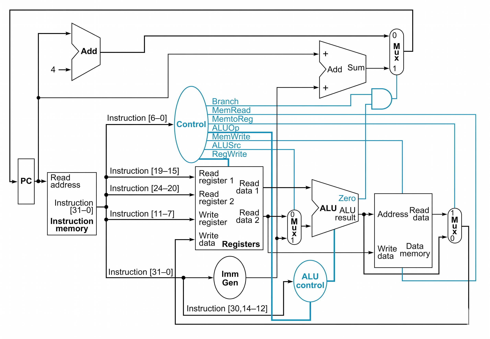
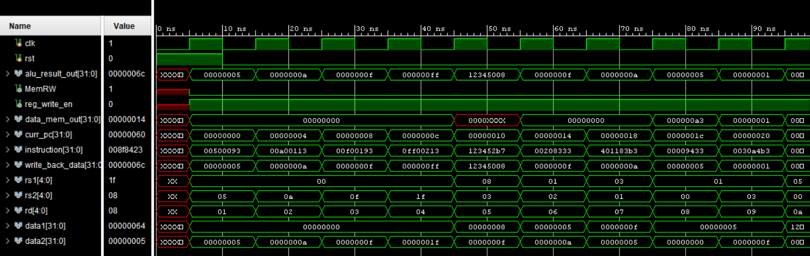

# RV32I Single-Cycle Processor
[]()
[]()
[]()

A 32-bit single-cycle RISC-V (RV32I) processor implemented in Verilog HDL as part of the Computer Organization & Assembly Language (COAL) course at GIK Institute.

This project focuses on the architectural design and hardware implementation of a modular RISC-V CPU capable of executing instructions from the RV32I base integer instruction set. The processor was designed completely from scratch using Verilog and verified through simulation waveforms and testbench validation.

---

## Features

- 32-bit single-cycle RV32I processor
- Harvard Architecture implementation
- Modular datapath design
- Separate instruction and data memory
- Instruction decoding and control logic
- Arithmetic Logic Unit (ALU)
- Register file with 32 registers
- Immediate generator for multiple instruction formats
- Branch and jump handling
- Byte, half-word, and word memory operations
- Simulation and verification using testbench waveforms

---

## Supported RV32I Instructions

### R-Type
- ADD
- SUB
- SLL
- SLT
- SLTU
- XOR
- SRL
- SRA
- OR
- AND

### I-Type
- ADDI
- SLTI
- SLTIU
- XORI
- SRLI
- SRAI
- ORI
- ANDI

### Load Instructions
- LB
- LH
- LW
- LBU
- LHU

### Store Instructions
- SB
- SH
- SW

### Branch Instructions
- BEQ
- BNE
- BLT
- BGE
- BLTU
- BGEU

### Jump & Upper Immediate Instructions
- JAL
- JALR
- LUI
- AUIPC

---

## Architecture Overview

The processor follows a single-cycle datapath architecture where each instruction completes execution within one clock cycle.

Major hardware modules include:

- Program Counter (PC)
- Instruction Memory
- Register File
- Immediate Generator
- ALU
- Branch Comparator
- Data Memory
- Control Unit
- Writeback Logic

The design follows Harvard Architecture principles by separating instruction memory and data memory to avoid structural hazards.

---

## Datapath Diagram



---

## Simulation Results

The processor functionality was verified through simulation waveforms and testbench validation.

Example verification included:
- Arithmetic operations
- Memory read/write operations
- Branch execution
- Jump instructions
- Register writeback
- Control signal validation



---

## Project Structure

```text
rv32i-single-cycle-processor/
│
├── src/
│   ├── top.v
│   ├── alu_logic.v
│   ├── branch_comp.v
│   ├── control_unit.v
│   ├── data_mem.v
│   ├── imm_gen.v
│   ├── inst_mem.v
│   ├── program_counter.v
│   └── reg_file.v
│
├── testbench/
│   └── top_tb.v
│
├── memory/
│   ├── instructions.mem
│   ├── data_mem.mem
│   └── reg_init.mem
│
├── docs/
│   ├── datapath_diagram.png
│   └── simulation_waveform.png
│
├── CEP_REPORT.pdf
├── README.md
└── LICENSE
```

---

## How to Run

1. Clone the repository

```bash
git clone https://github.com/your-username/rv32i-single-cycle-processor.git
```

2. Open the project in your preferred Verilog simulator
   - ModelSim
   - QuestaSim
   - Vivado Simulator
   - Icarus Verilog

3. Compile all source files and the testbench

4. Run the simulation

5. Observe waveform outputs and verify processor functionality

---

## Concepts Explored

This project provided hands-on experience with:

- Computer Architecture
- RTL Design
- Datapath Routing
- Control Signal Generation
- Memory Hierarchy
- Instruction Decoding
- Branch Resolution
- Timing Constraints
- Hardware Verification
- Verilog HDL Design

---

## Contributors

- Muhammad Husnain Jatoi
- Muhammad Musa
- Irtaza Shahbaz

Department of Computer Engineering  
Ghulam Ishaq Khan Institute of Engineering Sciences & Technology (GIKI)

---

## References

1. Harris & Harris — *Digital Design and Computer Architecture: RISC-V Edition*
2. Patterson & Hennessy — *Computer Organization and Design RISC-V Edition*
3. RISC-V User-Level ISA Specification
4. IEEE Verilog HDL Standard

---

## License

This project is licensed under the MIT License.
